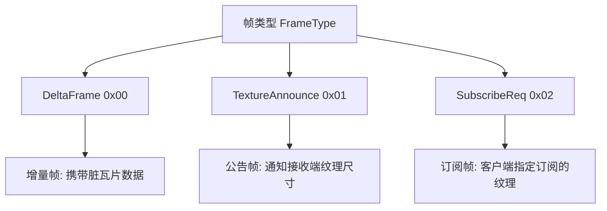
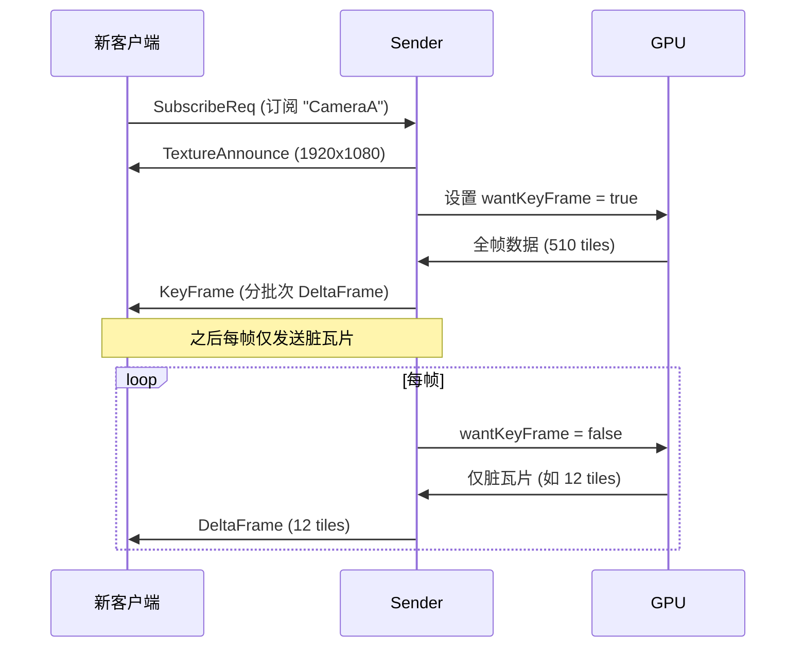
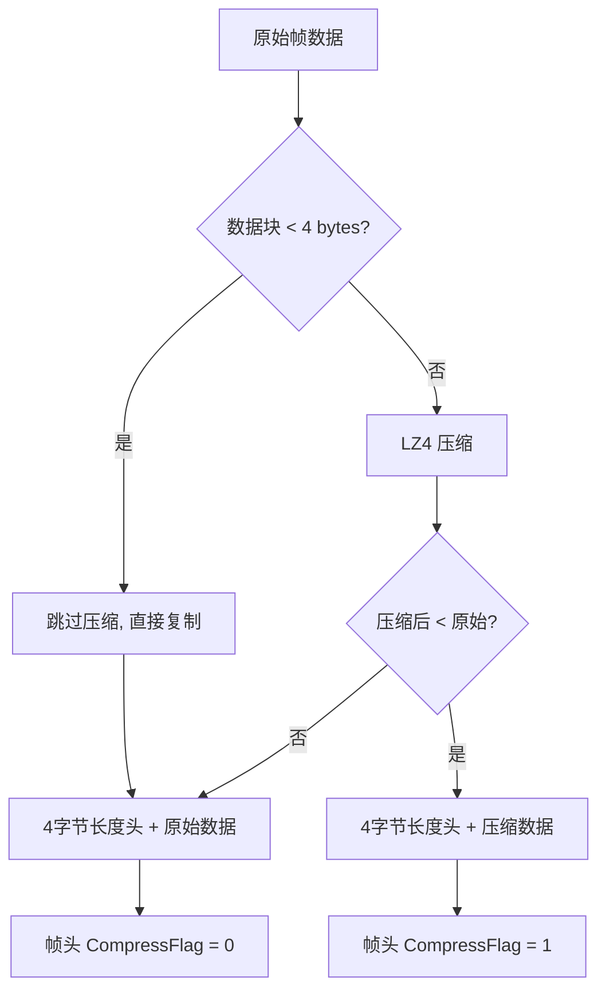
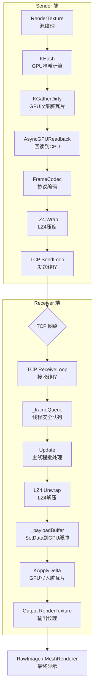
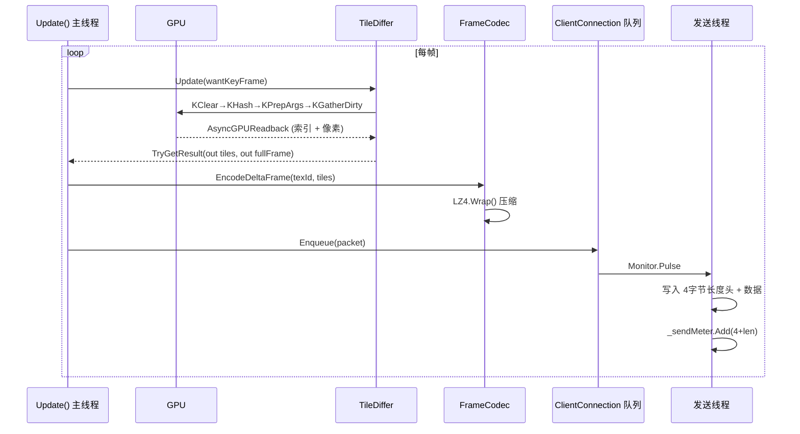
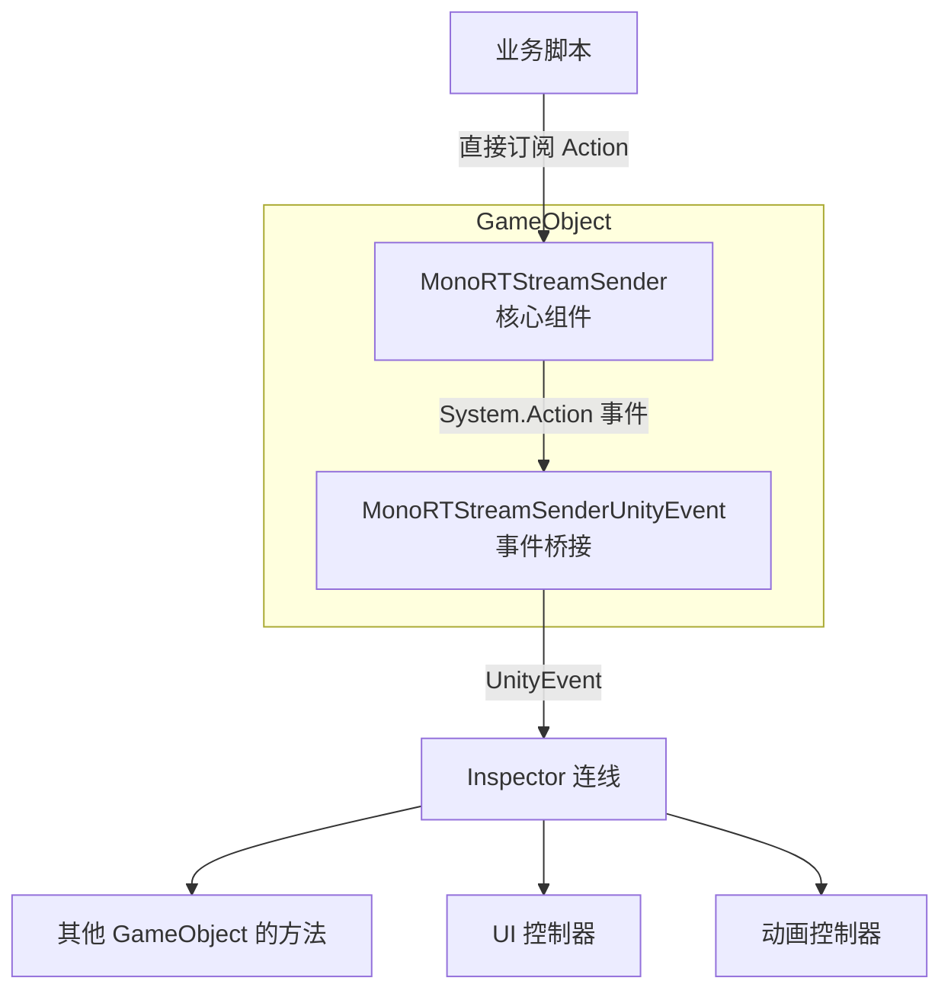
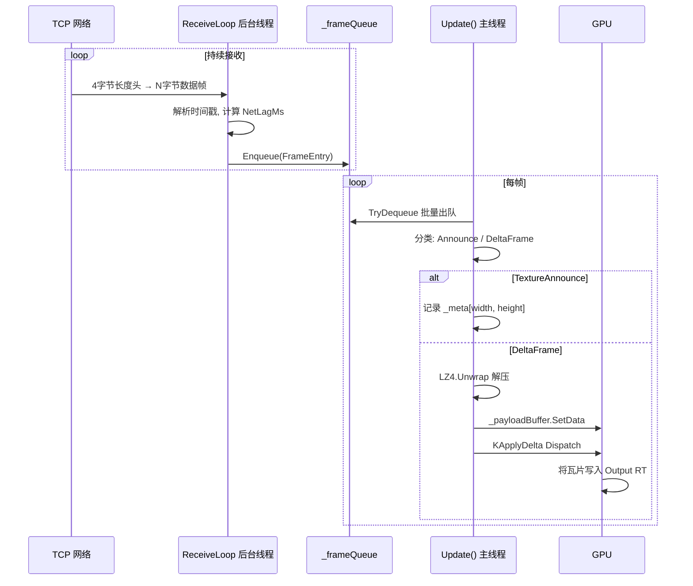
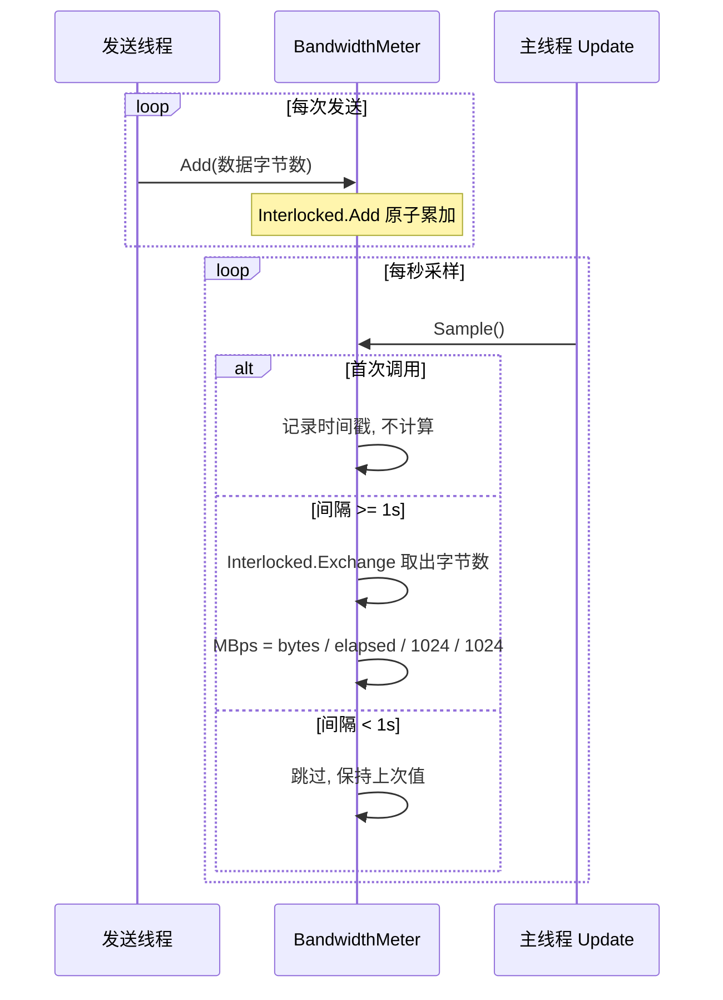
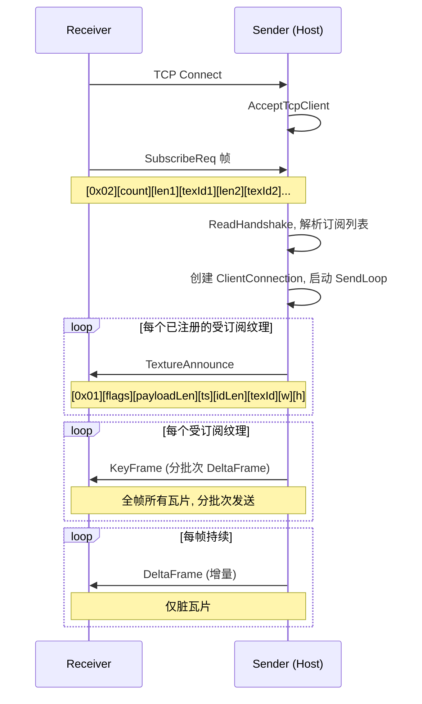

# RTStream 插件 API 说明文档

---

## 第一章  概述

### 1.1 插件定位

RTStream 是一个基于 **GPU 瓦片差分** 的 Unity 渲染纹理流式传输插件。通过 ComputeShader 检测纹理帧间变化，**仅传输脏瓦片**，经 LZ4 压缩后通过 TCP 发送至远端，接收端使用 ComputeShader 将脏瓦片还原到输出 RenderTexture 上。适用于需要实时画面同步的场景（虚拟演播、远程协作、多屏同步等）。

### 1.2 核心技术栈

| 层级 | 技术 |
|------|------|
| 差异检测 | ComputeShader 哈希比较 + AsyncGPUReadback |
| 数据压缩 | LZ4 快速压缩（纯 C# 实现） |
| 网络传输 | TCP 长连接，4 字节帧长度头 |
| 延迟诊断 | Stopwatch 高精度计时 + 独立带宽计量器 |
| GPU 应用 | ComputeShader DispatchIndirect 间接调度 |

---

## 第二章  快速上手

### 2.1 最小 Sender 搭建（6 步）

**第 1 步**：场景中创建 GameObject，挂载 `MonoRTStreamSender` 组件，将 `TileDiff.compute` 拖入 `_tileDiffShader` 字段。

**第 2 步**：编写启动脚本，订阅事件：

```csharp
using UnityEngine;
using WPZ0325.RTStream;

public class MySender : MonoBehaviour
{
    [SerializeField] private MonoRTStreamSender _sender;

    void Start()
    {
        _sender.OnHostStarted       += OnStarted;
        _sender.OnHostStopped       += OnStopped;
        _sender.OnClientConnected   += OnClientConnected;
        _sender.OnRenderTextureDirtyTilesSent += OnDirtyTilesSent;
    }

    void OnDestroy()
    {
        _sender.OnHostStarted       -= OnStarted;
        _sender.OnHostStopped       -= OnStopped;
        _sender.OnClientConnected   -= OnClientConnected;
        _sender.OnRenderTextureDirtyTilesSent -= OnDirtyTilesSent;
    }
}
```

**第 3 步**：启动监听：

```csharp
_sender.StartHost("0.0.0.0", 9500);
```

**第 4 步**：准备要传输的 RenderTexture（可通过 Camera.targetTexture 或自行创建）。

**第 5 步**：注册纹理（必须在主机启动后）：

```csharp
_sender.RegisterTexture("MainCamera", myRenderTexture);
```

**第 6 步**：运行时控制：

```csharp
_sender.SetTextureEnabled("MainCamera", false);  // 暂停
_sender.SetTextureEnabled("MainCamera", true);   // 恢复
_sender.UnregisterTexture("MainCamera");          // 注销
_sender.StopHost();                               // 停止服务
```

---

### 2.2 最小 Receiver 搭建（6 步）

**第 1 步**：场景中创建 GameObject，挂载 `MonoRTStreamReceiver` 组件，将 `TileApply.compute` 拖入 `_tileApplyShader` 字段。

**第 2 步**：编写接收脚本，订阅事件：

```csharp
using UnityEngine;
using WPZ0325.RTStream;

public class MyReceiver : MonoBehaviour
{
    [SerializeField] private MonoRTStreamReceiver _receiver;

    void Start()
    {
        _receiver.OnConnectedToHost      += OnConnected;
        _receiver.OnDisconnectedFromHost += OnDisconnected;
        _receiver.OnRenderTextureAnnounced += OnAnnounced;
    }

    void OnDestroy()
    {
        _receiver.OnConnectedToHost      -= OnConnected;
        _receiver.OnDisconnectedFromHost -= OnDisconnected;
        _receiver.OnRenderTextureAnnounced -= OnAnnounced;
    }
}
```

**第 3 步**：创建输出 RenderTexture（**必须启用 enableRandomWrite**）：

```csharp
RenderTexture outputRT = new RenderTexture(width, height, 0, RenderTextureFormat.ARGB32)
{
    enableRandomWrite = true,
    filterMode = FilterMode.Bilinear
};
```

**第 4 步**：绑定输出纹理：

```csharp
_receiver.BindOutputTexture("MainCamera", outputRT);
```

**第 5 步**：连接到发送端（第三个参数传 `null` 表示订阅全部纹理）：

```csharp
_receiver.Connect("127.0.0.1", 9500, null);
```

**第 6 步**：将 outputRT 显示到 UI 或 Mesh：

```csharp
// 方式A: UI RawImage
myRawImage.texture = outputRT;

// 方式B: MeshRenderer
myMeshRenderer.material.mainTexture = outputRT;
```

---

## 第三章  核心概念

### 3.1 瓦片模型

纹理被等分为 **64x64 像素** 的瓦片网格。例如 1920x1080 纹理被划分为 30x17 = 510 个瓦片。

```
┌───┬───┬───┬───┬───┐
│(0,0)│   │   │   │   │
├───┼───┼───┼───┼───┤
│   │   │   │   │   │  ← 每个瓦片 64x64 px, 16 KB (RGBA)
├───┼───┼───┼───┼───┤
│   │   │   │   │   │
└───┴───┴───┴───┴───┘
```

| 参数 | 值 |
|------|-----|
| 瓦片尺寸 | 64x64 像素 |
| 单瓦片字节数 | 64 x 64 x 4 = 16384 字节 (16 KB) |
| 纹理对齐 | 宽高须为 64 的整数倍 |

### 3.2 帧类型



| 枚举值 | 含义 | 方向 |
|--------|------|------|
| `DeltaFrame` (0x00) | 增量帧，携带脏瓦片列表 | Sender → Receiver |
| `TextureAnnounce` (0x01) | 纹理公告，尺寸元数据 | Sender → Receiver |
| `SubscribeReq` (0x02) | 订阅请求，指定 texId | Receiver → Sender |

### 3.3 关键帧 vs 增量帧

| | 关键帧（KeyFrame） | 增量帧（DeltaFrame） |
|---|---|---|
| 触发条件 | 新客户端连接、纹理恢复同步 | 每帧帧间差异 |
| 数据量 | 全帧所有瓦片 | 仅脏瓦片 |
| 编码方式 | 分批次编码为 DeltaFrame | 直接编码为 DeltaFrame |
| GPU 管线 | `KGatherAll` 全量回读 | `KHash→KGatherDirty` 差异回读 |



### 3.4 订阅模型

- **全订阅**：`Connect(host, port, null)` — 接收所有已注册纹理
- **指定订阅**：`Connect(host, port, new[]{"CameraA","CameraB"})` — 仅接收指定纹理

内部逻辑：发送端在 `Update()` 中遍历受订阅的纹理，跳过未订阅部分。

### 3.5 压缩策略



关键参数：最小匹配长度 4 字节，哈希表 16384 槽位，偏移量上限 65535。

### 3.6 数据流向



---

## 第四章  Sender API 参考

### 4.1 MonoRTStreamSender

#### 4.1.1 组件挂载与 Inspector 配置

挂载到任意 GameObject 上，在 Inspector 中传入 `TileDiff.compute`：

| 字段 | 类型 | 说明 |
|------|------|------|
| `_tileDiffShader` | ComputeShader | 挂载 `Assets/Plugins/WPZ0325/RTStream/Shaders/TileDiff.compute` |

#### 4.1.2 生命周期方法

---

**`StartHost(string ip, int port)`**

启动 TCP 监听，开始接受客户端连接。

| 参数 | 类型 | 说明 |
|------|------|------|
| `ip` | `string` | 监听 IP 地址，如 `"0.0.0.0"`（所有网卡）或 `"127.0.0.1"`（本地） |
| `port` | `int` | 监听端口号，范围 1-65535 |

- 内部创建 `TcpListener(IPAddress.Parse(ip), port)`，启动后台 `AcceptLoop` 线程
- 触发事件 `OnHostStarted`
- 重复调用前会自动清理上一次的监听状态（不触发 `OnHostStopped` 事件）

---

**`StopHost()`**

停止 TCP 监听，断开所有客户端，释放所有已注册纹理的 GPU 资源。

- 触发事件 `OnHostStopped`（仅在之前为运行状态时）
- 内部遍历 `_clients` 调用 `Shutdown()`
- 遍历 `_textures` 调用 `Differ.Dispose()`

---

#### 4.1.3 纹理管理方法

---

**`RegisterTexture(string texId, RenderTexture rt)`**

注册一个渲染纹理用于流式传输。

| 参数 | 类型 | 说明 |
|------|------|------|
| `texId` | `string` | 纹理全局唯一标识，不可为空，不可重复 |
| `rt` | `RenderTexture` | 待传输的 RenderTexture，不可为 null |

| 异常 | 条件 |
|------|------|
| `ArgumentException` | texId 为空或已存在 |
| `ArgumentNullException` | rt 为 null |
| `InvalidOperationException` | Host 尚未启动 |

- 内部创建 `TileDiffer` 并存入 `_textures` 字典
- 对每个订阅了此 texId 的在线客户端自动发送 `TextureAnnounce`
- 新客户端订阅的 texId 自动加入 `PendingKeyFrames` 列表
- 触发事件 `OnRenderTextureRegistered(texId, width, height)`

---

**`UnregisterTexture(string texId)`**

注销纹理，释放其 GPU 差异检测资源。

| 参数 | 类型 | 说明 |
|------|------|------|
| `texId` | `string` | 要注销的纹理标识 |

- 内部调用 `Differ.Dispose()` 释放 ComputeBuffer
- 触发事件 `OnRenderTextureUnregistered(texId)`
- texId 不存在时静默忽略

---

**`SetTextureEnabled(string texId, bool enabled)`**

启用或暂停指定纹理的同步。

| 参数 | 类型 | 说明 |
|------|------|------|
| `texId` | `string` | 纹理标识 |
| `enabled` | `bool` | true=恢复同步, false=暂停同步 |

- 恢复时：对在线且订阅了此 texId 的客户端加入 `PendingKeyFrames`，触发 `OnRenderTextureSyncStarted(texId)`
- 暂停时：触发 `OnRenderTextureSyncPaused(texId)`
- 纹理不存在或状态未变化时静默忽略

---

**`IsTextureEnabled(string texId)`**

查询指定纹理是否处于启用（同步中）状态。

| 返回值 | 条件 |
|--------|------|
| `true` | 纹理存在且处于启用状态 |
| `false` | 纹理不存在或已暂停 |

---

#### 4.1.4 诊断属性

| 属性 | 类型 | 线程安全 | 说明 |
|------|------|----------|------|
| `ClientCount` | `int` | 是 | 当前连接的客户端数量 |
| `TextureCount` | `int` | 是 | 已注册的纹理数量 |
| `ListenPort` | `int` | — | 当前监听端口号 |
| `IsRunning` | `bool` | — | Host 是否正在运行 |
| `DiagDirtyTiles` | `int` | — | 本帧检测到的脏瓦片总数（所有纹理合计） |
| `DiagReadbackBytes` | `int` | — | 所有纹理上一轮回读的字节总数 |
| `RawDirtyMBps` | `float` | — | 原始脏数据带宽（MB/s，含索引头） |
| `UpEncMBps` | `float` | — | 编码后上行带宽（MB/s） |
| `UpSendMBps` | `float` | — | 实际发送上行带宽（MB/s，含 TCP 帧头） |

#### 4.1.5 诊断方法

---

**`GetClientDiagnostics()`**

返回所有客户端的队列深度快照，供诊断使用。

| 返回值 | 格式示例 |
|--------|----------|
| `string` | `"C0 queue:3    C1 queue:0"` |
| `null` | 无客户端连接 |

---

#### 4.1.6 事件列表

| 事件 | 委托签名 | 触发时机 |
|------|----------|----------|
| `OnHostStarted` | `System.Action` | `StartHost()` 成功 |
| `OnHostStopped` | `System.Action` | `StopHost()` 执行（仅运行时） |
| `OnClientConnected` | `System.Action<int>` | 新客户端握手完成，参数为当前总客户端数 |
| `OnClientDisconnected` | `System.Action<int>` | 客户端断开且清理后，参数为当前总客户端数 |
| `OnRenderTextureRegistered` | `System.Action<string, int, int>` | `RegisterTexture()` 成功，参数: texId, width, height |
| `OnRenderTextureUnregistered` | `System.Action<string>` | `UnregisterTexture()` 或 `StopHost()` 时，参数: texId |
| `OnRenderTextureSyncStarted` | `System.Action<string>` | 纹理从暂停恢复为启用 |
| `OnRenderTextureSyncPaused` | `System.Action<string>` | 纹理从启用变为暂停 |
| `OnRenderTextureKeyFrameSent` | `System.Action<string>` | 关键帧（全帧）发送时 |
| `OnRenderTextureDirtyTilesSent` | `System.Action<string, int[]>` | 增量帧发送时，参数: texId, 脏瓦片索引数组 |

> **注意**：`OnClientDisconnected` / `OnClientConnected` 通过主线程队列派发，确保在 `Update()` 中安全回调。

#### 4.1.7 Sender 内部流水线



---

### 4.2 MonoRTStreamSenderUnityEvent

#### 4.2.1 组件说明

脚本挂载约束：

```csharp
[RequireComponent(typeof(MonoRTStreamSender))]
```

- 在 `Awake()` 中通过 `GetComponent<MonoRTStreamSender>()` 自动绑定核心组件
- 将所有 `System.Action` / `System.Action<T>` 事件转发为 `UnityEvent`，支持 Inspector 拖拽连线
- 在 `OnDestroy()` 中自动取消订阅
- `[SerializeField] private bool _debugLog` 控制是否在 Editor 中打印日志

#### 4.2.2 Inspector 可订阅的 UnityEvent

| UnityEvent | 类型 | 参数 |
|------------|------|------|
| `OnHostStarted` | `UnityEvent` | — |
| `OnHostStopped` | `UnityEvent` | — |
| `OnRenderTextureRegistered` | `UnityEvent<string, int, int>` | texId, width, height |
| `OnRenderTextureUnregistered` | `UnityEvent<string>` | texId |
| `OnRenderTextureSyncStarted` | `UnityEvent<string>` | texId |
| `OnRenderTextureSyncPaused` | `UnityEvent<string>` | texId |
| `OnRenderTextureKeyFrameSent` | `UnityEvent<string>` | texId |
| `OnRenderTextureDirtyTilesSent` | `DirtyTilesUnityEvent` | texId, indices[] |
| `OnClientConnected` | `UnityEvent<int>` | totalClients |
| `OnClientDisconnected` | `UnityEvent<int>` | totalClients |

#### 4.2.3 组件关系



---

## 第五章  Receiver API 参考

### 5.1 MonoRTStreamReceiver

#### 5.1.1 组件挂载与 Inspector 配置

挂载到任意 GameObject 上，在 Inspector 中传入 `TileApply.compute`：

| 字段 | 类型 | 说明 |
|------|------|------|
| `_tileApplyShader` | ComputeShader | 挂载 `Assets/Plugins/WPZ0325/RTStream/Shaders/TileApply.compute` |

#### 5.1.2 生命周期方法

---

**`Connect(string host, int port, string[] subscribedTexIds)`**

连接到发送端并开始接收数据。

| 参数 | 类型 | 说明 |
|------|------|------|
| `host` | `string` | 发送端 IP 地址 |
| `port` | `int` | 发送端监听端口 |
| `subscribedTexIds` | `string[]` | 订阅的纹理列表，`null` 表示订阅全部 |

- 内部创建 `TcpClient`，连接成功后先发送 `SubscribeReq` 握手帧
- 启动后台 `ReceiveLoop` 线程接收数据
- 连接成功触发 `OnConnectedToHost`
- 连接失败触发 `OnConnectionFailed(errorMessage)`

---

**`Disconnect()`**

断开与发送端的连接，清理所有资源。

- 设置 `_running = false` 通知接收线程退出
- 清空 `_frameQueue` 和 `_batch`
- 调用 `Close()` 关闭 TcpClient 和 NetworkStream
- 不清除 `_outputTextures` 和 `_meta`（供重复 Connect 使用）

---

#### 5.1.3 纹理绑定方法

---

**`BindOutputTexture(string texId, RenderTexture rt)`**

将指定 texId 绑定到输出 RenderTexture。收到对应帧数据时，GPU 直接写入此 RT。

| 参数 | 类型 | 说明 |
|------|------|------|
| `texId` | `string` | 纹理标识，需与发送端一致 |
| `rt` | `RenderTexture` | 输出目标，**必须 `enableRandomWrite = true`** |

- 内部存入 `_outputTextures` 字典
- 可重复调用以覆盖绑定

---

**`UnbindOutputTexture(string texId)`**

解除指定 texId 的输出绑定。

| 参数 | 类型 | 说明 |
|------|------|------|
| `texId` | `string` | 纹理标识 |

---

#### 5.1.4 诊断属性

| 属性 | 类型 | 说明 |
|------|------|------|
| `IsConnected` | `bool` | 是否已连接到发送端 |
| `LastBatchSize` | `int` | 上一帧批处理的数据包数量 |
| `DirtyTilesReceived` | `int` | 本帧接收到的脏瓦片总数 |
| `RemoteHost` | `string` | 远端发送端主机地址 |
| `RemotePort` | `int` | 远端发送端端口 |
| `NetLagMs` | `float` | 网络延迟（ms，基于帧内时间戳差值） |
| `LocalLagMs` | `float` | 本地排队延迟（ms，从入队到主线程处理） |
| `SilenceMs` | `float` | 距最后一次收到数据的静默时间（ms） |
| `DownRecvMBps` | `float` | 下行接收带宽（MB/s） |
| `DownProcMBps` | `float` | 下行处理带宽（MB/s，解码+GPU应用） |

#### 5.1.5 事件列表

| 事件 | 委托签名 | 触发时机 |
|------|----------|----------|
| `OnConnectedToHost` | `System.Action` | Connect 成功 |
| `OnDisconnectedFromHost` | `System.Action` | 接收线程检测到断连 |
| `OnConnectionFailed` | `System.Action<string>` | Connect 失败，参数为异常消息 |
| `OnRenderTextureAnnounced` | `System.Action<string, int, int>` | 收到 TextureAnnounce，参数: texId, width, height |
| `OnRenderTextureDirtyTilesReceived` | `System.Action<string, int[]>` | 脏瓦片数据已应用，参数: texId, 脏瓦片索引数组 |

#### 5.1.6 Receiver 内部流水线



---

### 5.2 MonoRTStreamReceiverUnityEvent

#### 5.2.1 组件说明

脚本挂载约束：

```csharp
[RequireComponent(typeof(MonoRTStreamReceiver))]
```

- 在 `Awake()` 中自动绑定核心组件
- 将所有事件转发为 UnityEvent
- `[SerializeField] private bool _debugLog` 控制日志

#### 5.2.2 Inspector 可订阅的 UnityEvent

| UnityEvent | 类型 | 参数 |
|------------|------|------|
| `OnConnectedToHost` | `UnityEvent` | — |
| `OnDisconnectedFromHost` | `UnityEvent` | — |
| `OnConnectionFailed` | `UnityEvent<string>` | errorMessage |
| `OnRenderTextureAnnounced` | `UnityEvent<string, int, int>` | texId, width, height |
| `OnRenderTextureDirtyTilesReceived` | `DirtyTilesUnityEvent` | texId, indices[] |

---

## 第六章  辅助类型参考

### 6.1 FrameCodec

静态协议帧编解码器，负责帧打包、解包和纹理公告/订阅帧的编解码。

命名空间：`WPZ0325.RTStream`

#### 6.1.1 常量

| 常量 | 类型 | 值 | 说明 |
|------|------|-----|------|
| `TileSize` | `int` | 64 | 瓦片像素尺寸 |
| `HeaderSize` | `int` | 15 | 协议帧头部字节数 |

#### 6.1.2 诊断属性

| 属性 | 类型 | 说明 |
|------|------|------|
| `LastEncodeComprBytes` | `int` | 最近一次编码的压缩后字节数 |
| `LastEncodeOrigBytes` | `int` | 最近一次编码的原始字节数 |
| `LastDecodeComprBytes` | `int` | 最近一次解码的压缩字节数 |
| `LastDecodeDecompBytes` | `int` | 最近一次解码的解压后字节数 |

#### 6.1.3 编码方法（内部使用，供扩展参考）

| 方法 | 返回值 | 说明 |
|------|--------|------|
| `EncodeDeltaFrame(string texId, List<DirtyTile> tiles)` | `byte[]` | 编码增量帧，自动压缩 |
| `EncodeTextureAnnounce(string texId, ushort w, ushort h)` | `byte[]` | 编码纹理公告帧 |
| `EncodeSubscribeReq(string[] texIds)` | `byte[]` | 编码订阅请求帧，`null`=全订阅 |

#### 6.1.4 解码工具方法（内部使用）

| 方法 | 返回值 | 说明 |
|------|--------|------|
| `GetTexId(byte[] packet)` | `string` | 读取纹理标识 |
| `GetTileCount(byte[] packet)` | `ushort` | 读取瓦片数量（不含压缩标志位） |
| `GetTimestamp(byte[] packet)` | `long` | 读取时间戳（UTC Ticks） |
| `IsCompressed(byte[] packet)` | `bool` | 判断负载是否 LZ4 压缩 |
| `GetBytesPerTile()` | `int` | 计算单瓦片字节数 = 64×64×4 |
| `GetTilePayloadOffset(byte[] packet)` | `int` | 获取帧数据中瓦片负载起始偏移 |
| `TryParseTextureAnnounce(byte[], out string, out ushort, out ushort)` | `bool` | 解析纹理公告帧 |
| `TryParseSubscribeReq(byte[], out string[])` | `bool` | 解析订阅请求帧 |

---

### 6.2 BandwidthMeter

带宽计量器，通过累加 + 定时采样的方式估算实时吞吐量（MB/s）。线程安全。

命名空间：`WPZ0325.RTStream`

| 成员 | 签名 | 说明 |
|------|------|------|
| `MBps` | `float` (get) | 最近一次采样的带宽值 |
| `Add(long bytes)` | `void` | 累加字节数（线程安全，`Interlocked.Add`） |
| `Sample()` | `void` | 取样并计算带宽。至少间隔 1 秒才生成新值 |
| `Reset()` | `void` | 重置所有计数器与状态 |

#### 6.2.3 采样逻辑



---

### 6.3 LZ4

LZ4 快速压缩算法的纯 C# 实现。封装格式为 4 字节原始长度 + LZ4 压缩数据体。

命名空间：`WPZ0325.RTStream`

| 方法 | 签名 | 说明 |
|------|------|------|
| `Wrap` | `static byte[] Wrap(byte[] input, out int originalSize, out int compressedSize)` | 压缩并封装 |
| `Unwrap` | `static byte[] Unwrap(byte[] input, out int compressedSize, out int decompressedSize)` | 解包并解压 |

**Wrap 行为**：
- 输入 < 4 字节：不压缩，直接复制
- 压缩后 >= 原始大小：**丢弃压缩结果**，使用原始数据（避免膨胀）
- 输出格式：`[4字节 origSize][压缩体]`

**Unwrap 行为**：
- 解压尺寸校验：`> 0 && <= 1GB`，否则抛出 `InvalidOperationException`
- 压缩体长度 = 原始长度时：直接复制（未压缩的极小数据块）

---

### 6.4 数据结构

#### 6.4.1 DirtyTile

脏矩形瓦片数据。

```csharp
public struct DirtyTile
{
    public int index;    // 瓦片在纹理中的线性索引
    public byte[] data;  // 瓦片像素数据 (RGBA32, TileSize*TileSize*4 字节)
}
```

#### 6.4.2 DiagTextureInfo

诊断用纹理信息。

```csharp
public struct DiagTextureInfo
{
    public string TexId;  // 纹理标识名称
    public int Width;     // 纹理宽度
    public int Height;    // 纹理高度
}
```

#### 6.4.3 FrameType

帧类型标识枚举。

```csharp
public enum FrameType : byte
{
    DeltaFrame       = 0x00,  // 增量帧
    TextureAnnounce  = 0x01,  // 纹理公告帧
    SubscribeReq     = 0x02   // 订阅请求帧
}
```

#### 6.4.4 DirtyTilesUnityEvent

自定义 UnityEvent 类型，供桥接组件使用。

```csharp
[System.Serializable]
public class DirtyTilesUnityEvent : UnityEvent<string, int[]> { }
```

---

## 第七章  协议规范

### 7.1 帧整体结构

每帧通过 TCP 发送，格式为：**4 字节帧长度（小端序）+ 帧数据**。

帧数据 = 15 字节固定头 + 可变长负载。

```
┌──────────┬──────────┬──────────┬──────────┐
│ 帧长度   │                   帧数据               │
│ (4 bytes)│                                        │
├──────────┼──────────┬──────────┬─────────────────┤
│          │ 帧类型   │ Flags    │ PayloadLen       │
│          │ (1 byte) │ (2 bytes)│ (4 bytes)        │
│          ├──────────┴──────────┴─────────────────┤
│          │ 时间戳 (8 bytes, UTC Ticks)            │
│          ├────────────────────────────────────────┤
│          │ 可变负载 ...                            │
└──────────┴────────────────────────────────────────┘
```

| 偏移 | 大小 | 字段 |
|------|------|------|
| 0 | 1 | `FrameType` — 帧类型 (0x00/0x01/0x02) |
| 1 | 2 | `Flags` — bit15=LZ4压缩标志, bit0-14=瓦片数量 |
| 3 | 4 | `PayloadLen` — 负载长度（字节） |
| 7 | 8 | `Timestamp` — 发送端 UTC Ticks |
| 15 | PayloadLen | 负载数据 |

### 7.2 帧格式

**DeltaFrame (0x00) — 增量帧 / 关键帧**

```
┌──────┬───────────────────┬───────────┬──────────────┬────────────────────────────┐
│ 0x00 │ Flags (2B)        │ PayloadLen│ Timestamp    │ Load                       │
│ (1B) │ bit15=压缩 bit0~14│ (4B)      │ (8B, UTC Ticks)│                           │
│      │ =瓦片数            │           │              │                           │
├──────┴───────────────────┴───────────┴──────────────┤                           │
│                   Header (15B)                      │  idLen(1B)                │
│                                                    │  texId(idLen B)           │
│                                                    │  T1_idx(4B) | T1_data     │
│                                                    │  T2_idx(4B) | T2_data ... │
└────────────────────────────────────────────────────┴───────────────────────────┘
```

**TextureAnnounce (0x01) — 纹理公告帧**

```
┌──────┬────────────┬───────────┬────────────────┬──────────────────────────┐
│ 0x01 │ 0x0000     │ PayloadLen│ Timestamp      │ idLen(1B) | texId        │
│ (1B) │ (2B)       │ (4B)      │ (8B, UTC Ticks)│ Width(2B) | Height(2B)   │
└──────┴────────────┴───────────┴────────────────┴──────────────────────────┘
```

**SubscribeReq (0x02) — 订阅请求帧**

```
┌──────┬───────┬──────┬──────────┬──────┬──────────┬─────┐
│ 0x02 │ count │ len1 │ texId1   │ len2 │ texId2   │ ... │
│ (1B) │ (1B)  │ (1B) │ (len1 B) │ (1B) │ (len2 B) │     │
└──────┴───────┴──────┴──────────┴──────┴──────────┴─────┘
```

### 7.3 握手流程



### 7.4 LZ4 封装格式

```
┌──────────────────┬──────────────────────┐
│ 原始长度          │ 压缩数据体             │
│ (4 bytes,Int32)   │ (compressedSize bytes)│
└──────────────────┴──────────────────────┘
```

- 原始长度用于解压时预分配输出缓冲区
- 原始长度 = 压缩体长度 时表示未压缩（极小数据块）
- 安全性校验：解压后尺寸 1 ～ 1GB，越界抛出异常

### 7.5 压缩标志位与自适应策略

| Flags bit15 | 含义 |
|-------------|------|
| 0 | 负载未压缩（压缩后体积 >= 原始体积） |
| 1 | 负载已 LZ4 压缩 |

编码时策略：

```
1. 先执行 LZ4.Wrap() 获取压缩结果
2. 比较 compressed.Length vs 原始 payload.Length
3. 若压缩后更小 → 使用压缩数据, 帧头 CompressFlag=1
4. 否则 → 使用原始数据, 帧头 CompressFlag=0
```

解码时策略：

```
1. 读取帧头 bit15
2. 若置位 → LZ4.Unwrap() 解压
3. 否则 → 直接使用原始负载
```

---

## 第八章  使用范例

### 8.1 Sender 端完整代码示例

```csharp
using UnityEngine;
using WPZ0325.RTStream;

public class StreamSenderExample : MonoBehaviour
{
    [SerializeField] private MonoRTStreamSender _sender;
    [SerializeField] private Camera _sourceCamera;

    private RenderTexture _rt;

    void Start()
    {
        _sender.OnHostStarted            += OnHostStarted;
        _sender.OnHostStopped            += OnHostStopped;
        _sender.OnClientConnected        += OnClientConnected;
        _sender.OnClientDisconnected     += OnClientDisconnected;
        _sender.OnRenderTextureRegistered   += OnRenderTextureRegistered;
        _sender.OnRenderTextureUnregistered += OnRenderTextureUnregistered;

        // 创建相机渲染目标
        _rt = new RenderTexture(1920, 1080, 0, RenderTextureFormat.ARGB32)
        {
            filterMode = FilterMode.Bilinear
        };
        _sourceCamera.targetTexture = _rt;

        // 启动并注册
        _sender.StartHost("0.0.0.0", 9500);
        _sender.RegisterTexture("MainCamera", _rt);
    }

    void OnDestroy()
    {
        _sender.OnHostStarted            -= OnHostStarted;
        _sender.OnHostStopped            -= OnHostStopped;
        _sender.OnClientConnected        -= OnClientConnected;
        _sender.OnClientDisconnected     -= OnClientDisconnected;
        _sender.OnRenderTextureRegistered   -= OnRenderTextureRegistered;
        _sender.OnRenderTextureUnregistered -= OnRenderTextureUnregistered;

        _sender.StopHost();
        if (_rt != null) _rt.Release();
    }

    void OnHostStarted()
    {
        Debug.Log($"Host started on port {_sender.ListenPort}");
    }

    void OnHostStopped()
    {
        Debug.Log("Host stopped");
    }

    void OnClientConnected(int total)
    {
        Debug.Log($"Client connected. Total: {total}");
    }

    void OnClientDisconnected(int total)
    {
        Debug.Log($"Client disconnected. Total: {total}");
    }

    void OnRenderTextureRegistered(string id, int w, int h)
    {
        Debug.Log($"Registered: {id} ({w}x{h})");
    }

    void OnRenderTextureUnregistered(string id)
    {
        Debug.Log($"Unregistered: {id}");
    }
}
```

### 8.2 Receiver 端完整代码示例

```csharp
using UnityEngine;
using UnityEngine.UI;
using WPZ0325.RTStream;

public class StreamReceiverExample : MonoBehaviour
{
    [SerializeField] private MonoRTStreamReceiver _receiver;
    [SerializeField] private RawImage _displayImage;

    private RenderTexture _outputRT;

    void Start()
    {
        _receiver.OnConnectedToHost        += OnConnected;
        _receiver.OnDisconnectedFromHost   += OnDisconnected;
        _receiver.OnConnectionFailed       += OnConnectionFailed;
        _receiver.OnRenderTextureAnnounced += OnTextureAnnounced;

        // 预先创建输出 RT (初始尺寸可为任意值, 稍后被 TextureAnnounce 修正)
        _outputRT = new RenderTexture(1920, 1080, 0, RenderTextureFormat.ARGB32)
        {
            enableRandomWrite = true,       // 关键!
            filterMode = FilterMode.Bilinear
        };

        _receiver.BindOutputTexture("MainCamera", _outputRT);
        _displayImage.texture = _outputRT;

        _receiver.Connect("127.0.0.1", 9500, new[] { "MainCamera" });
    }

    void OnDestroy()
    {
        _receiver.OnConnectedToHost        -= OnConnected;
        _receiver.OnDisconnectedFromHost   -= OnDisconnected;
        _receiver.OnConnectionFailed       -= OnConnectionFailed;
        _receiver.OnRenderTextureAnnounced -= OnTextureAnnounced;

        _receiver.Disconnect();
        if (_outputRT != null) _outputRT.Release();
    }

    void OnConnected()
    {
        Debug.Log($"Connected to {_receiver.RemoteHost}:{_receiver.RemotePort}");
    }

    void OnDisconnected()
    {
        Debug.Log("Disconnected");
    }

    void OnConnectionFailed(string error)
    {
        Debug.LogError($"Connection failed: {error}");
    }

    void OnTextureAnnounced(string texId, int w, int h)
    {
        Debug.Log($"Texture announced: {texId} ({w}x{h})");

        // 动态调整输出 RT 尺寸
        if (_outputRT.width != w || _outputRT.height != h)
        {
            _outputRT.Release();
            _outputRT.width = w;
            _outputRT.height = h;
            _outputRT.Create();
        }
    }
}
```

### 8.3 多纹理场景

```csharp
// Sender 端
_sender.RegisterTexture("CameraA", rtA);
_sender.RegisterTexture("CameraB", rtB);
_sender.RegisterTexture("UI_Overlay", rtUI);

// Receiver 端 — 仅订阅需要的纹理
_receiver.BindOutputTexture("CameraA", outputRT_A);
_receiver.BindOutputTexture("UI_Overlay", outputRT_UI);

_receiver.Connect("192.168.1.100", 9500, new[] { "CameraA", "UI_Overlay" });
// "CameraB" 不会被接收
```

### 8.4 纹理暂停/恢复

```csharp
// 暂停同步 (如切换到其他场景时节省带宽)
_sender.SetTextureEnabled("MainCamera", false);

// 恢复同步 (自动发送关键帧)
_sender.SetTextureEnabled("MainCamera", true);

// 查询状态
bool isActive = _sender.IsTextureEnabled("MainCamera");
```

### 8.5 使用 UnityEvent 桥接（零代码方案）

无需编写 C#，直接在 Inspector 中操作：

1. 场景中同时挂载 `MonoRTStreamSender` + `MonoRTStreamSenderUnityEvent`
2. 在 `MonoRTStreamSenderUnityEvent` 组件的 Inspector 中，展开各 UnityEvent 列表
3. 将其他 GameObject 拖入，选择目标方法

```
GameObject: StreamHost
  ├── MonoRTStreamSender           ← 挂载 TileDiff.compute
  └── MonoRTStreamSenderUnityEvent ← 自动绑定, 暴露 UnityEvent

Inspector 连线示例:
  OnHostStarted → UIManager.ShowConnectedIndicator()
  OnClientConnected → UIManager.UpdateClientCount(int)
```

> 注意：UnityEvent 不支持 `string, int[]` 类型的直接连线（DirtyTilesUnityEvent 需要在代码中订阅），其余所有事件均可 Inspector 连线。

### 8.6 诊断面板集成

```csharp
using UnityEngine;
using WPZ0325.RTStream;

public class SimpleDiagnostics : MonoBehaviour
{
    [SerializeField] private MonoRTStreamSender _sender;

    void OnGUI()
    {
        if (_sender == null) return;

        GUILayout.Label($"Port: {_sender.ListenPort}    Clients: {_sender.ClientCount}");
        GUILayout.Label($"Dirty Tiles: {_sender.DiagDirtyTiles}");
        GUILayout.Label($"Raw: {_sender.RawDirtyMBps:F3}  Enc: {_sender.UpEncMBps:F3}  Send: {_sender.UpSendMBps:F3} MB/s");

        string diag = _sender.GetClientDiagnostics();
        if (!string.IsNullOrEmpty(diag))
            GUILayout.Label(diag);

        GUILayout.Label($"LZ4: {FrameCodec.LastEncodeOrigBytes / 1024f:F1} → {FrameCodec.LastEncodeComprBytes / 1024f:F1} KB");
    }
}
```

---

## 第九章  常见问题

### 9.1 输出 RT 无画面

**原因**：Receiver 端未设置 `enableRandomWrite = true`。

**解决**：
```csharp
// 错误 ❌
RenderTexture rt = new RenderTexture(w, h, 0, RenderTextureFormat.ARGB32);

// 正确 ✅
RenderTexture rt = new RenderTexture(w, h, 0, RenderTextureFormat.ARGB32)
{
    enableRandomWrite = true
};
```

GPU 通过 `KApplyDelta` ComputeShader 以 `RWTexture2D` 写入 RT，若未启用随机写入，Dispatch 将静默失败。

### 9.2 连接失败排查

| 现象 | 可能原因 | 解决 |
|------|----------|------|
| ConnectionFailed 事件触发 | 端口未开放 | 确认 Sender 已 StartHost |
| 连接后无画面 | texId 不匹配 | 确认 RegisterTexture 和 BindOutputTexture 使用相同 texId |
| 连接后无画面 | 订阅列表不包含目标纹理 | `Connect` 第三个参数传 `null` 或包含目标 texId |
| 大量脏瓦片无显示 | RT 尺寸不匹配 | 在 `OnRenderTextureAnnounced` 中动态调整 `outputRT` 尺寸 |

### 9.3 纹理尺寸约束

- 发送端纹理宽高应为 **64 的整数倍**（TileDiffer 构造函数中：`_tileSize > texWidth` 时自动缩至纹理宽度）
- 非 64 倍数时，右侧/底部边缘瓦片会缩小适配，但建议对齐以获得最佳性能

### 9.4 性能优化建议

| 建议 | 说明 |
|------|------|
| 纹理尺寸对齐 64 | 避免边缘瓦片产生额外开销 |
| 控制帧率 | 发送端通过 `Application.targetFrameRate` 或 QualitySettings 限制 |
| 订阅过滤 | Receiver 仅订阅需要的纹理，减少不必要的网络传输 |
| 暂停空闲纹理 | 不需要同步时调用 `SetTextureEnabled(id, false)` |
| 带宽监控 | 使用 `RawDirtyMBps` / `UpSendMBps` 评估瓶颈 |
| 队列深度监控 | 使用 `GetClientDiagnostics()` 检查是否有积压 |

### 9.5 多客户端带宽管理

每个客户端独立维护发送队列和带宽计量。发送端 `Update()` 中：

1. 编码一次帧数据
2. 遍历所有在线客户端，分别 `Enqueue(packet)`
3. 各客户端发送线程独立计量 `_upSendBandwidth`

若需限制单客户端带宽，可监控 `GetClientDiagnostics()` 返回的队列深度，超过阈值时降低帧率或跳过该客户端的 `Enqueue` 调用。
